# Getting Started with the Formabble Interface

In this chapter we will guide you through the UI in Formabble. From creating your domain, to importing your first asset, we will guide you through the essential steps required to get started on making your first game!

??? note "Creating a Domain"
    After Logging in, you will be greeted with the Main Menu window. To create a domain you can either click on the **New Domain button** or the **Import Domain button**.

    The first method,  upon clicking New Domain, a fresh empty domain will be immediately created. Your domain will be given a randomly generated name and be automatically saved.

    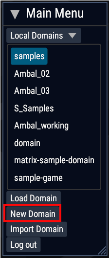

    The second method, upon clicking the Import Domain, your file explorer window will pop-up, for you to import an .fdb file.

    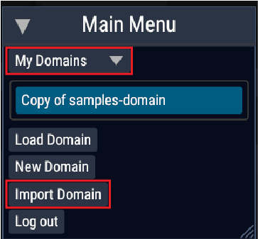

    

    From the file explorer window, you can either import an existing file or type a file name and click save to create a new domain with the specified name.

??? note "Importing Assets"
    Assets are the lifeblood of any domain. To import assets, either click on the **Import** button from your **Domain Inventory** window or simply drag the asset from your file explorer into the **Domain Inventory** window.

    

    If the **Import button** was been clicked, the file explorer window will pop up for you to import your asset. Certain asset categories can accept multiple file extensions. Remember to click on the correct file extension.

    | File Category | Extension Type |
    | -------- | -------- |
    | Scripts | .shs |
    | Textures | .jpg .png |
    | Meshes | .gltf |
    | Audio | .ogg .mp3 |

    Once an asset has been selected, or has been dragged in the **Import Asset** window will appear. Click on **Import button** to import the asset.

    

    Once imported, it will appear in the **Domain Inventory**. (Click on the **Category** dropdown to change the category of the assets currently being shown in the inventory. Change it accordingly if you don't see your asset.)

    

    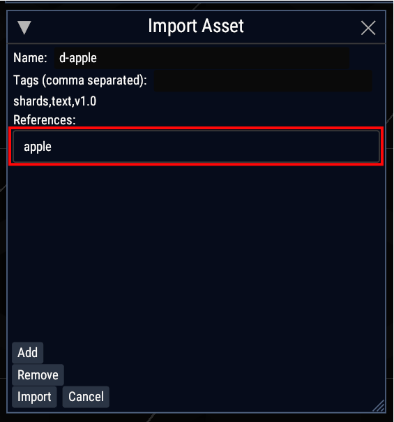

    Congratulations! You have imported your first asset!

??? note "Adding References to an asset"
    It is not uncommon for your scripts to reference an asset. You can do this at two points. When you are importing an asset and after it has been imported. Let’s try referencing the apple that we have just imported.

    In this example, we are importing a script that will render our apple 3d model. To do that it needs to reference our apple.

    

    The first method, to reference our apple, with the **Import Asset** window open, drag the apple from the **Domain Inventory** into the **References** section in the **Import Asset** window.

    

    Once the asset has been added it will appear under **References** in the **Edit Asset** window.

    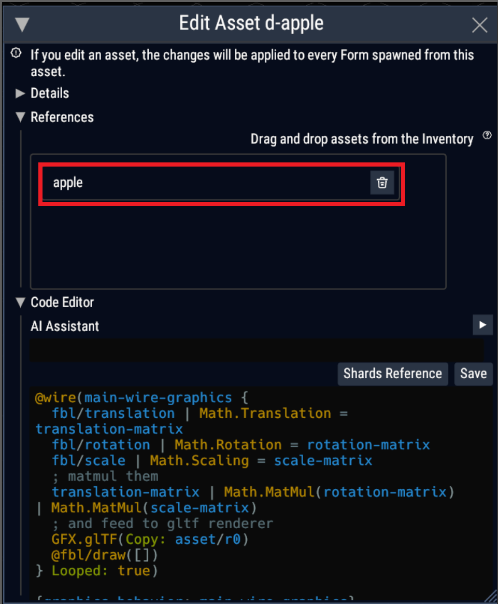

    The second way to do it is after you have imported the script. From the **Domain Inventory** window, click on the **Asset Options** button.

    

    Once the **Asset Options** button has been clicked, the **Asset Options** window will appear.

    

    From the **Assets Options Window**, click on **Edit Button** to bring up the **Edit Asset Window**.

    From the **Edit Asset Window** click on the References drop down toggle to see all of the asset's current references.

    

    From here, simply drag the asset you want to reference from the **Domain Inventory** into the **References** category in the **Edit Asset Window**.

    

    Lastly click on **Save** to sve your changes.

    

    If you accidentally add the wrong reference, you can also remove it. First click on the reference to remove from the References list, thenSimply click on the **Delete** button next to the referenced asset in the **Edit Asset Reference List**.

    

    Once removed, the asset will disappear from the **References list**. Lastly, click on **Save** to save your changes.

??? note "Formalizing Assets"
    Now that you have your assets uploaded, the next step is to add them into your domain. To do this, from the **Asset Options Window**, click on the **Formalize button**.

    

    Alternatively, simply drag the asset from **Domain Inventory** to the domain.You should see your form in your domain! Do note that if your scripts has errors or if it does not have the requires references, it will not formalize. Formabble also can’t formalize images or 3d models as they are. They have to be referenced in a script and then formalized. To see how to create such a script, refer to the “load-3d-asset” and “load-2d-asset” samples from the samples domain.

    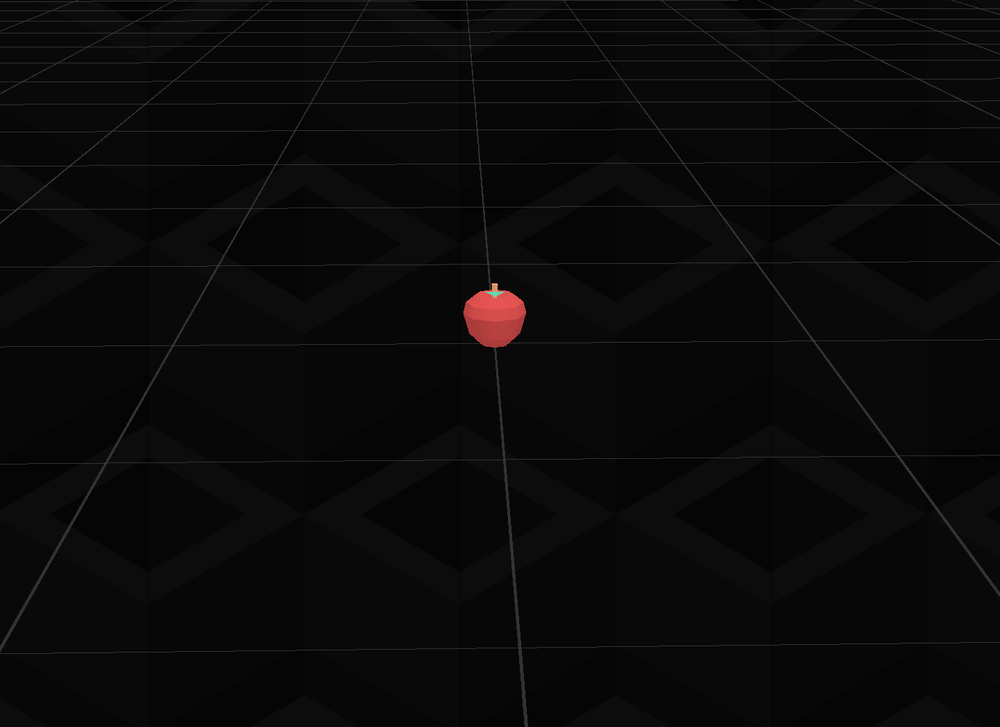

??? note "Form Gizmos"
    With your assets formalized inside your domain, the next step to creating your game is to manipulate these assets. The Formabble gizmos will help you in this task. When you click on your 3d form, you will see the form gizmo pop-up. (The **Form Gizmo** will not pop-up for non-3D forms, such as UI elements).

    

    Now I will guide you through what each of the buttons in the form gizmo will do. The button on the top right will put the gizmo into translation mode. In **translation mode** , you will see arrows on your forms. Click on the appropriate arrow to change the form’s X, Y and Z translation. To put it simply, it is the "move" button.

    

    You can also click on the plane square’s to move the form freely along the plane. Clicking on the blue square for example will move the form freely along the XY plane.

    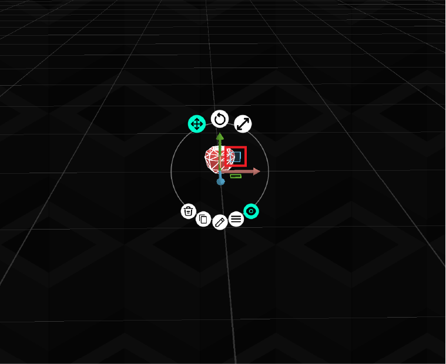

    Next, clicking on the center button on the top row will put the gizmo into **rotation mode**. In **rotation mode**, you will see multiple rings around your forms. Click on the appropriate rings and drag your mouse pointer to change the rotation of your form.

    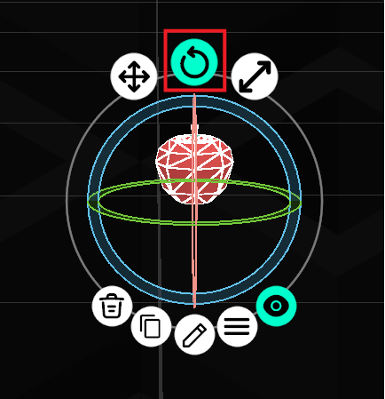

    Lastly clicking on the button on the top right will put the gizmo into **scaling mode**. In **scaling mode**, click on the appropriate cubes and drag your mouse to change the X,Y and Z scale of your form.

    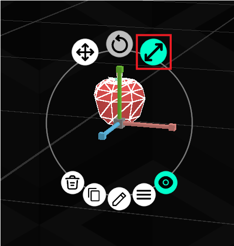

    Moving on to the bottom row of buttons, the button on the left will **delete** your form.

    

    The second button from the left, will **duplicate** your form.

    

    The button after that does nothing for now. TODO

    The button after that also does nothing for now TODO

    The button on the most right will **hide** all the other buttons on the gizmo. Click it again **unhide** them.

    

??? note "Domain Side Menu"
    In a domain you will find a Side menu. The buttons in this side menu each have different functionality that will help with your navigation and workflow effeciency.

    

    This section will get you up to speed on what each button does.
    The first button is the menu button. Upon clicking the menu button, you will see a list of buttons that each correspond to a window in your domain.

    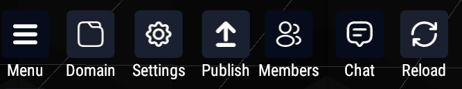

     

    ###Domain

    

    Functionality tbd

     

    ###Settings

    

    The Settings button either hide/show the Settings Menu where you can edit your Editor Settings.

    

     

    ###Publish

    

    Functionality tbd

     

    ###Members

    

    The Members button will either hide/show the Domain Sharing Window, which houses all the options regarding to Domain Sharing.

    

     

    ###Chat

    

    The Chat button will either hide/show the Chat Window which can be used to chat with other members in your domain or be used to display your Domain Log.

    

     

    ###Reload

    

    Functionality tbd

     

    The next button in the side menu is the Things button.

    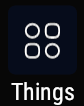

    The Things button will reveal buttons that handle assets and forms in your domain.

    

    ###OLA

    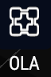

    The OLA button will either hide/show the Open Library of Assets window, which is where you can download or purchase assets that have been uploaded by other users into our library of open assets.

    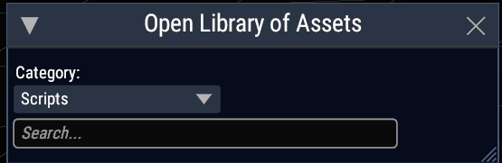

     

    ###Inventory

    

    The Inventory button will either hide/show the Inventory Window which houses all the assets and forms that have been imported into your domain.

    

     

    ###Forms

    

    The Forms button will either hide/show the Forms Details window where you can find information on the Form currently selected.

    

     

    The next button in the Side Menu is the Camera button. The Camera button will recenter your camera back to the camera origin.

    

    The button following this is the Hide/Unhide button. This button will either hide or reveal all open Formabble windows and UI in the scene.

    

    The last buttons in the Side Menu are the Undo and Redo buttons. Undo will undo your last action while Redo will enact the last action that has been undone. It is important to note that Undo and Redo is only limited to actions done by you and not your members.

    

??? note "Editing Asset Code"
    Formabble supports an all in one experience and thus allows creators to edit their code within Formabble itself. To do this, from the **Domain Inventory** window, click on the asset's **Option button** and from the **Asset Options** menu, click on **Edit**.

    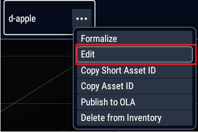

    Then from the **Edit Asset** window, edit the asset's code in the **Code Editor** section.

    

    Remember to click on **Save** to save your changes

    

    Should you wish, you can also edit your code using your preferred Code Editor. To do this, from the **Edit Asset** window, click on **Open Locally**. This will open your file explorer to the location of the selected file. From here you can open this file using your preferred code editor. Saving your changes on your code editor will automatically update the asset in Formabble for a seemless experience.

    

??? note "Deleting Assets"
    Sometimes we might accidentally add an asset or have an asset that is now redundant much later on in development. To delete an click on the asset in the **Domain Inventory** window. and click on **Asset Options** button.

    

    Once the Update Asset Window is open, click on Delete(permanently) to delete the asset from your Domain Inventory. **Warning!** Deleting an asset will delete it from all objects that are referencing it. This might kill your forms and leave them as dead forms. Remember to check through all your assets before deleting them.

    [Asset Delete Button](images/domain-inventory-delete.png "Asset Delete Button")

??? note "Editor Settings"
    In the **Settings** window, you will find useful settings to tune your Formabble interface to your needs.

    [Settings Menu](images/editor-settings-menu.png "Settings Menu")

    **Show world grid** - checking/unchecking this box will hide/show the world grid

    **World Grid Step Size** - Changing this value would increas/decrease the size of your world grid.

    **World Grid Size** - Changing this value will increase/decrease how far spread is your world grid in your domain.

    **World Grid Opacity** - This value controls how opaque/transparent the lines on your world grid are.

    **Editor Camera field of View** - Will increase/decrease how zoomed in your field of view is.

    **Editor UI Scale** - will increase/decrease how large/small the Formabble UI panels will appear on your screen.

